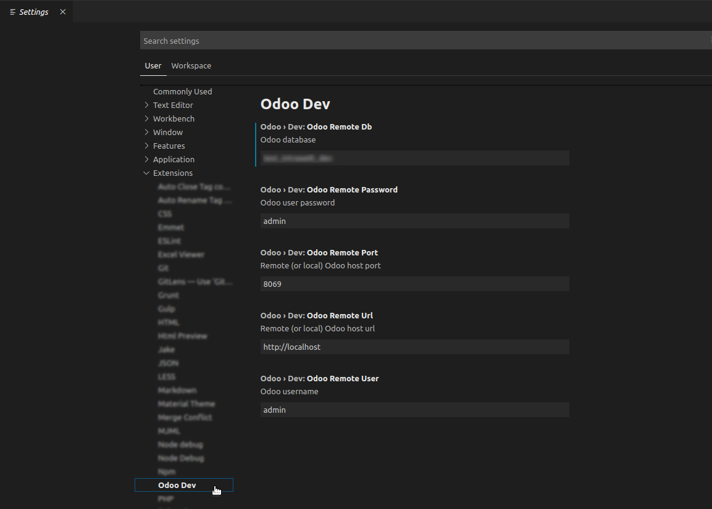

# Commands

## Odoo Dev - Create Security Rule

Select a line with _name or _inherit and create a security rule based on it

### Use

## Odoo Dev - Model From Remote

Select a line with _name or _inherit and get information on a model based on data in an Odoo istance

### Configuration

In Visual Studio Code settings define Odoo connection informations

### Use

# Support

